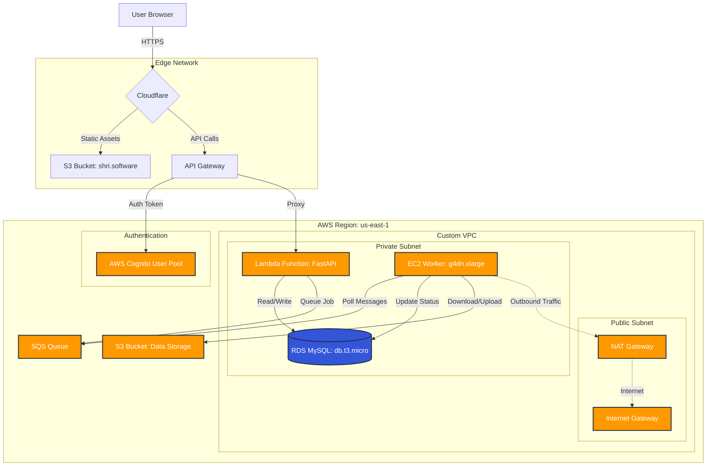
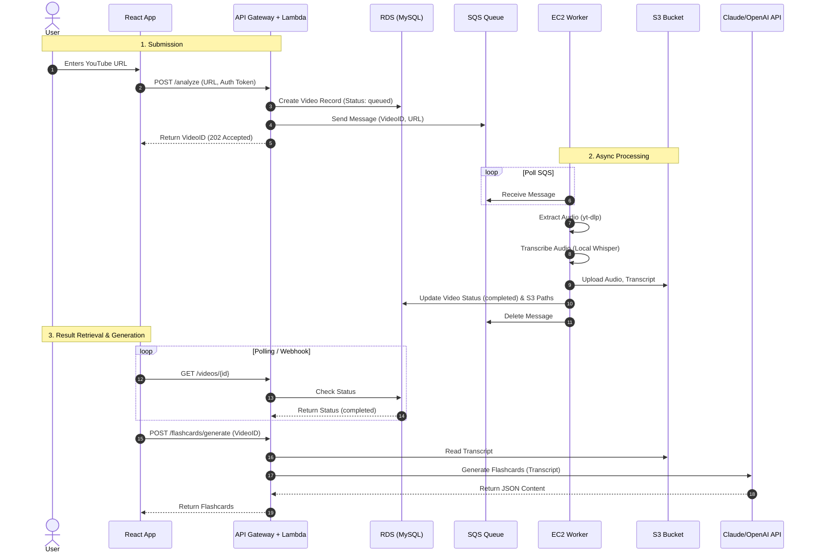

# YT-Analyzer System Architecture

## 1. High-Level Overview
**YT-Analyzer** is a cloud-native Single Page Application (SPA) designed to download, transcribe, and analyze YouTube videos using AI. It leverages a serverless-first approach for the API and a dedicated compute instance for heavy AI processing.

### Core Components
1.  **Frontend**: React-based SPA hosted on S3 + Cloudflare.
2.  **Authentication**: Managed by AWS Cognito (User Pools + Google OAuth).
3.  **API Layer**: Serverless AWS Lambda functions exposed via API Gateway.
4.  **Async Worker**: EC2 instance (GPU-optimized) for video processing and AI transcription (Whisper).
5.  **Data Persistence**: AWS RDS (MySQL) for relational data and S3 for object storage.

---

## 2. AWS Infrastructure Architecture

---

## 3. Component Breakdown

### A. Frontend (Presentation Layer)
-   **Tech Stack**: React, Vite, TailwindCSS.
-   **Hosting**: AWS S3 (Static Website Hosting).
-   **Delivery**: Cloudflare CDN (caches content at the edge).
-   **Security**:
    -   **SSL/TLS**: Flexible Mode (Cloudflare terminates HTTPS).
    -   **Bot Protection**: Cloudflare Turnstile (Smart CAPTCHA) on Login/Signup.
    -   **DDoS**: Cloudflare Bot Fight Mode.

### B. Backend API (Control Plane)
-   **Tech Stack**: Python, FastAPI, Mangum (Adapter).
-   **Compute**: AWS Lambda (Serverless).
-   **Role**: Handles user requests, authentication, CRUD operations, and job queuing.
-   **Networking**: Runs in a **Private Subnet** to access RDS securely.

### C. Asynchronous Worker (Data Plane)
-   **Tech Stack**: Python, `yt-dlp`, `faster-whisper`, `ffmpeg`.
-   **Compute**: AWS EC2 (`g4dn.xlarge` recommended for Production).
-   **Role**:
    1.  Polls SQS for new video jobs.
    2.  Downloads video/audio using `yt-dlp`.
    3.  Transcribes audio using OpenAI Whisper (AI).
    4.  Generates Flashcards/Quizzes using LLMs (Claude/GPT).
    5.  Uploads results to S3 and updates RDS.

### D. Database & Storage
-   **Relational DB**: AWS RDS (MySQL). Stores Users, Videos, Transcripts metadata.
-   **Object Storage**: AWS S3. Stores raw audio files, transcript text files, and generated JSON assets.

---

## 4. Security Architecture
1.  **Network Security**:
    -   Database and Worker are isolated in **Private Subnets** (No direct Internet access).
    -   Outbound traffic flows through a **NAT Gateway**.
    -   **Security Groups** strictly limit ports (e.g., RDS only accepts traffic on port 3306 from Lambda/EC2).

2.  **Application Security**:
    -   **JWT Authentication**: All API endpoints verify Cognito Access Tokens.
    -   **Bot Mitigation**: Turnstile prevents automated signups.
    -   **CORS**: Strictly configured to allow only `https://shri.software`.

3.  **Data Security**:
    -   **Encryption at Rest**: RDS and S3 encryption enabled.
    -   **Encryption in Transit**: HTTPS enforced via Cloudflare.

---

## 5. System Workflow

