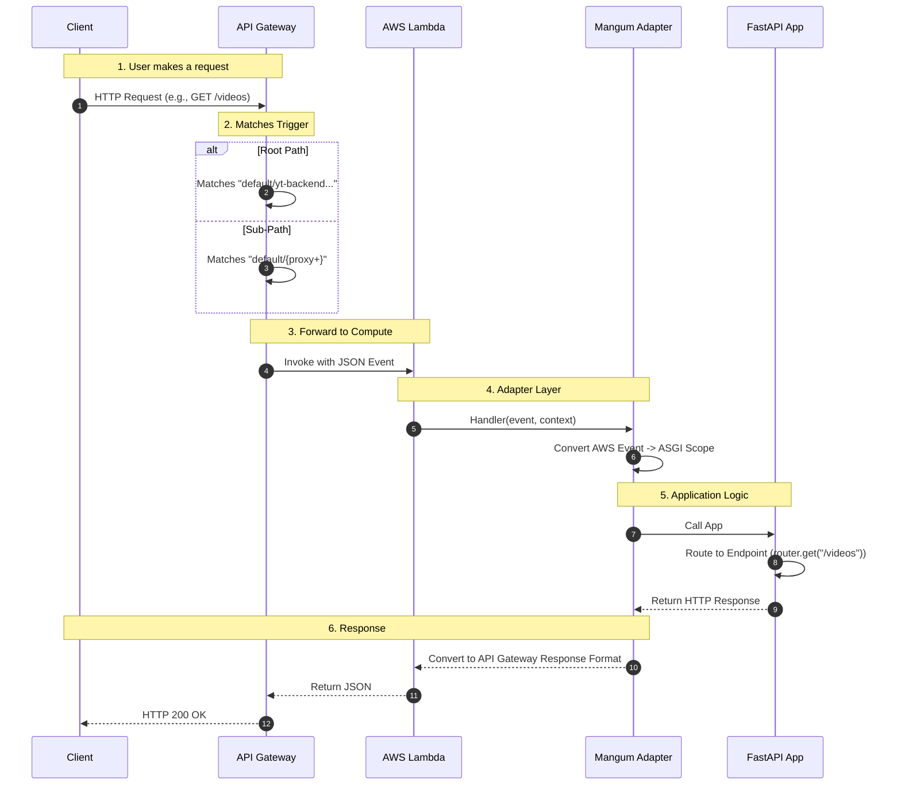

# Backend Documentation

## 1. Overview
The backend is a **Serverless REST API** built with **FastAPI** (Python) and deployed on **AWS Lambda**. It handles user requests, manages data in **AWS RDS (MySQL)**, and offloads heavy processing tasks to an SQS queue.

## 2. Project Structure
```
backend/
├── src/
│   ├── api/              # API Route Handlers
│   │   └── routes.py     # Endpoints (Videos, Transcripts)
│   ├── database/         # Database Layer
│   │   ├── database.py   # SQLAlchemy Engine & Session
│   │   └── models.py     # DB Models (User, Video, Transcript)
│   ├── services/         # Business Logic
│   │   └── sqs_service.py # SQS Integration
│   └── main.py           # FastAPI App Entry Point
├── Dockerfile            # Lambda Container Image
├── requirements.txt      # Python Dependencies
└── deploy_worker.sh      # Worker Setup Script
```

## 3. API Layer (FastAPI + Lambda)
-   **Framework**: FastAPI (High performance, auto-docs).
-   **Adapter**: `Mangum` wraps the FastAPI app to handle AWS Lambda events.
-   **Deployment**: Packaged as a Docker container or Zip file.

### Request Flow (API Gateway -> Lambda -> FastAPI)



### Key Endpoints
-   `POST /analyze`: Accepts a YouTube URL.
    -   Validates the URL.
    -   Creates a `Video` record in RDS (Status: `queued`).
    -   Sends a message to **SQS**.
-   `GET /videos`: Returns a list of videos for the authenticated user.
-   `DELETE /videos/{id}`: Deletes video metadata and S3 assets.

## 4. Database Schema (RDS MySQL)
We use **SQLAlchemy** ORM.

### Tables
1.  **Users**:
    -   `id` (String): Cognito Sub (Primary Key).
    -   `email` (String).
2.  **Videos**:
    -   `id` (UUID): Primary Key.
    -   `user_id` (String): Foreign Key to Users.
    -   `url` (String): YouTube URL.
    -   `title` (String).
    -   `status` (Enum): `queued`, `processing`, `completed`, `failed`.
    -   `s3_path` (String): Path to raw audio.
3.  **Transcripts**:
    -   `id` (UUID).
    -   `video_id` (UUID): Foreign Key.
    -   `content` (Text): Full transcript.
    -   `s3_path` (String): Path to transcript file.

## 5. Asynchronous Processing (SQS)
-   **Queue**: AWS SQS (Standard Queue).
-   **Message Format**:
    ```json
    {
      "video_id": "uuid",
      "url": "https://youtube.com/...",
      "user_id": "cognito-sub"
    }
    ```
-   **Flow**: API pushes to SQS -> Worker polls SQS.

## 6. Security
-   **VPC**: Lambda runs in a **Private Subnet** to access RDS.
-   **Authentication**: All endpoints expect a valid Cognito JWT in the `Authorization` header.
-   **CORS**: Configured to allow requests only from `https://shri.software`.
